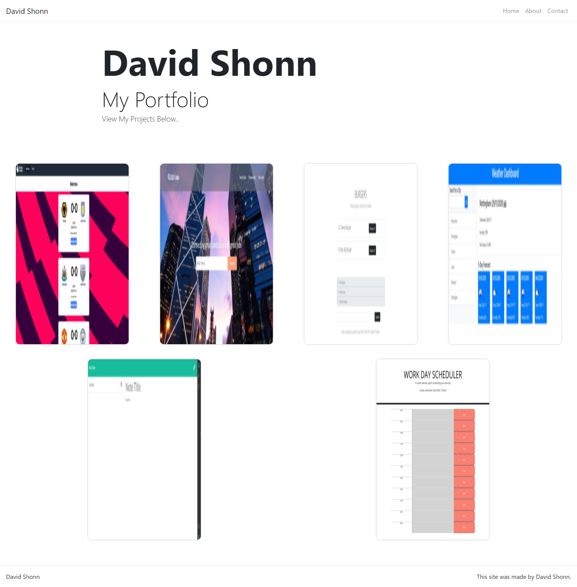

# Unit 20 React Homework: React Portfolio

Now that I've worked with React and have multiple projects to share, I have updated my portfolio and other materials to build toward being employer competitive. Creating a portfolio using React will help to set myself apart from other developers whose portfolios do not use some of the latest technologies.

## Screen Capture of Live Website

#

#

#

#

### [My Portfolio...](https://davidlshonn.github.io/week-20-react-portfolio/ "My Portfolio")
